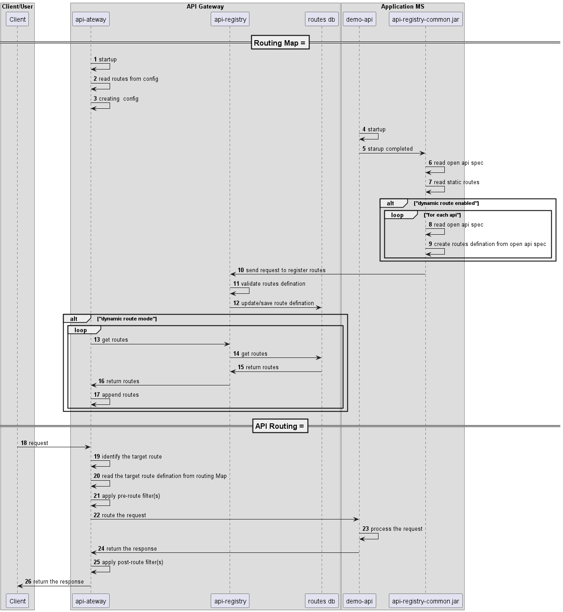

[](logo.png)

# Api Gateway
[](https://github.com/eclipse-ecsp/api-gateway/actions/workflows/maven-build.yml)
[](https://sonarcloud.io/summary/new_code?id=eclipse-ecsp_api-gateway)
[](https://sonarcloud.io/summary/new_code?id=eclipse-ecsp_api-gateway)
[](https://github.com/eclipse-ecsp/api-gateway/actions/workflows/licence-compliance.yaml)
[](https://github.com/eclipse-ecsp/api-gateway/releases)

API Gateway acts as a single entry point for all client requests to access backend APIs. It processes requests in two main ways: either by routing them directly to the appropriate service or by distributing (fanning out) the request to multiple services. Spring Cloud API Gateway supports one-size-fits-all style API.

# Table of Contents

* [Getting Started](#getting-started)
* [Architecture](#architecture)
* [Usage](#usage)
* [How to contribute](#how-to-contribute)
* [Built with Dependencies](#built-with-dependencies)
* [Code of Conduct](#code-of-conduct)
* [Contributors](#contributors)
* [Security Contact Information](#security-contact-information)
* [Support](#support)
* [Troubleshooting](#troubleshooting)
* [License](#license)
* [Announcements](#announcements)

## Getting Started

Spring Cloud Gateway provides 2 ways to configure the routes with gateway.

* Static Routing - User has to manually configure the route definitions in the application.yml
* Dynamic Routing - Api-registry-common has the capability to read the open api annotations mentioned on the endpoints
  and creates the route definitions and stores in postgressql database

To build the project in the local working directory after the project has been cloned/forked, run:

```mvn clean install```

from the command line interface.

### Prerequisites

The list of tools required to build and run the project:
1. Java 17
2. Apache Maven 3.8 or higher

### Installation

[How to set up Maven](https://maven.apache.org/install.html)

[Install Java](https://www.tutorials24x7.com/java/how-to-install-openjdk-17-on-windows)

### Coding style check configuration

[checkstyle.xml](./checkstyle.xml) is the coding standard to follow while writing new/updating existing code.

Checkstyle plugin [maven-checkstyle-plugin:3.2.1](https://maven.apache.org/plugins/maven-checkstyle-plugin/) is
integrated in [pom.xml](./pom.xml) which runs in the `validate` phase and `check` goal of the maven lifecycle and fails
the build if there are any checkstyle errors in the project.

To run the checkstyle plugin, run the below maven command.

```mvn checkstyle:check```

### Running the tests

To run the tests for this system run the below maven command.

```mvn test```

Or run a specific test

```mvn test -Dtest="TheFirstUnitTest"```

To run a method from within a test

```mvn test -Dtest="TheSecondUnitTest#whenTestCase2_thenPrintTest2_1"```

### Deployment

We can deploy this component as a Kubernetes pod by installing api-gateway and api-registry charts.

Link:
[Charts](../../../ecsp-helm-charts/tree/main/api-gateway)

## Architecture

Sequence diagram of api-gateway-spring:

[](api-gateway-diagram.png)

## Usage

1. API-Gateway provides a robust solution for managing and routing HTTP request in microservice architecture. It
   dynamically registers routes and applies filters to validate requests and responses. Also offers built-in resilience
   and monitoring features to ensure scalable and reliable API management.

2. Spring Cloud API gateway does provide single entry point for all clients to allow access of backend APIs. The API
   gateway handles requests in one of two ways. Some requests are simply proxied/routed to the appropriate service. It
   handles other requests by fanning out to multiple services. Spring Cloud API gateway, also provide a
   one-size-fits-all style API, the API gateway can expose a different API for each client.

3. The API gateway also implement security, e.g. verify that the client is authorized to perform the request by
   validating the Oath2 token(JWT).A variation of this pattern is the Backends for frontends pattern. It defines a
   separate API gateway for each kind of client.

4. Spring Cloud Gateway features:

* Built on Spring Framework 5, Project Reactor and Spring Boot 2.0
* Able to match routes on any request attribute.
* Predicates and filters are specific to routes.
* Circuit Breaker integration.
* Spring Cloud Discovery Client integration
* Easy to write Predicates and Filters
* Request Rate Limiting
* Path Rewriting
* Response Caching

## Built With Dependencies

* [Spring](https://spring.io/projects/spring-framework) - Web framework used for building the application
* [Spring cloud Gateway](https://spring.io/projects/spring-cloud-gateway/) – API Gateway for routing and filtering requests
* [Maven](https://maven.apache.org/) - Build tool used for dependency management
* [PostgreSQL](https://jdbc.postgresql.org/) - Relational database
* [MongoDB](https://www.mongodb.com/docs/drivers/java-drivers/) - NoSQL document database
* [Apache Common](https://commons.apache.org/proper/commons-lang/) - Provides utility classes for various Java operations
* [Jackson](https://github.com/FasterXML) - Library for parsing and generating JSON
* [Logback](https://logback.qos.ch/) - Concrete logging implementation used with SLF4J
* [slf4j](https://www.slf4j.org/) - Logging facade providing abstraction for various logging frameworks
* [Mockito](https://site.mockito.org/) - Mocking framework for testing
* [JUnit5](https://junit.org/) - Unit testing framework 
* [Lombok](https://projectlombok.org/) - Auto-generates Java boilerplate code (e.g., getters, setters, builders)
* [Redis](https://redis.io/docs/latest/develop/use/client-side-caching/) - In-memory data store used for caching & Rate Limiting
* [Spring doc Open-Api](https://springdoc.org/) - Automatically generates interactive API documentation (Swagger UI) from Spring controllers

## How to contribute

Please read [CONTRIBUTING.md](./CONTRIBUTING.md) for details on our contribution guidelines, and the process for
submitting pull requests to us.

## Code of Conduct

Please read [CODE_OF_CONDUCT.md](./CODE_OF_CONDUCT.md) for details on our code of conduct, and the process for
submitting pull requests to us.

## Contributors

* **[Abhishek Kumar](https://github.com/abhishekkumar-harman)** - *Initial work*

The list of [contributors](../../graphs/contributors) who participated in this project.

## Security Contact Information

Please read [SECURITY.md](./SECURITY.md) to raise any security related issues.

## Support

Contact the project developers via the project's "dev" list - https://accounts.eclipse.org/mailing-list/ecsp-dev

## Troubleshooting

Please read [CONTRIBUTING.md](./CONTRIBUTING.md) for details on how to raise an issue and submit a pull request to us.

## License

This project is licensed under the Apache-2.0 License - see the [LICENSE](./LICENSE) file for details

## Announcements

All updates to this component are present in our [releases page](../../releases).
For the versions available, see the [tags on this repository](../../tags).
